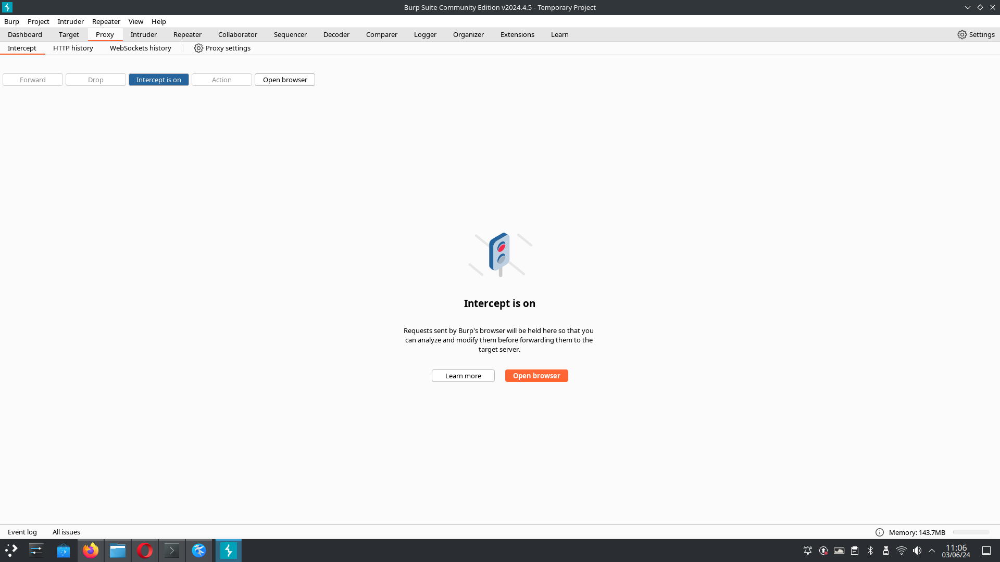
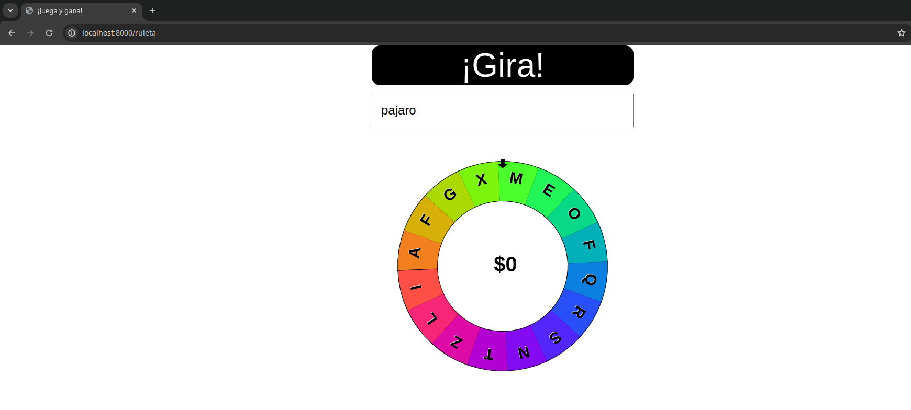
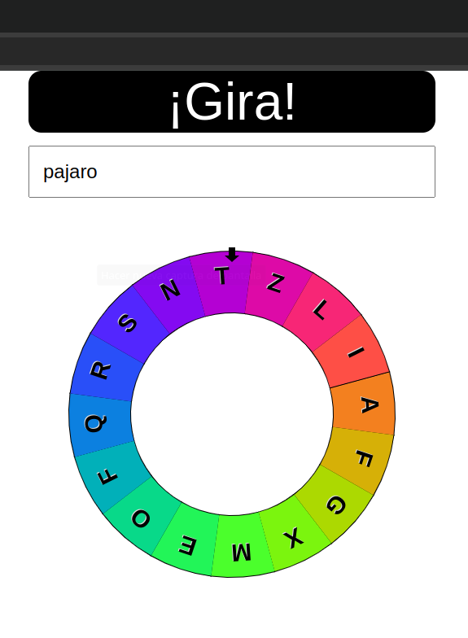
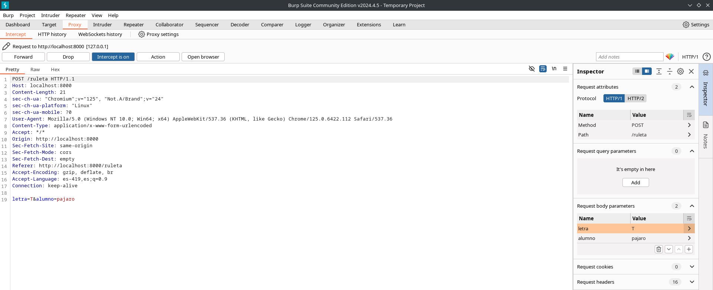
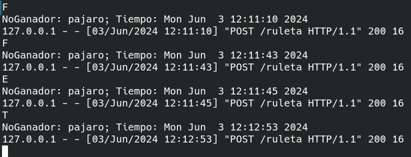
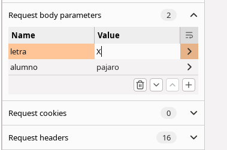
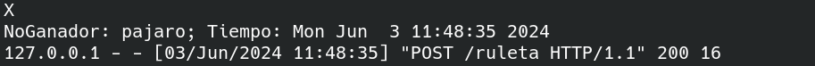
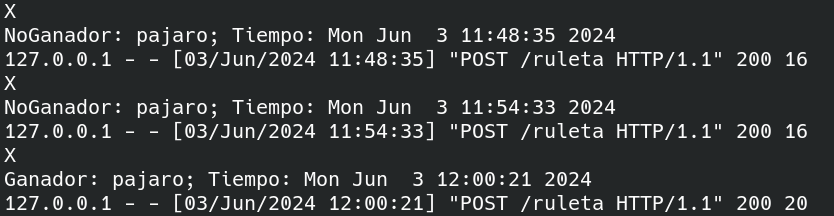
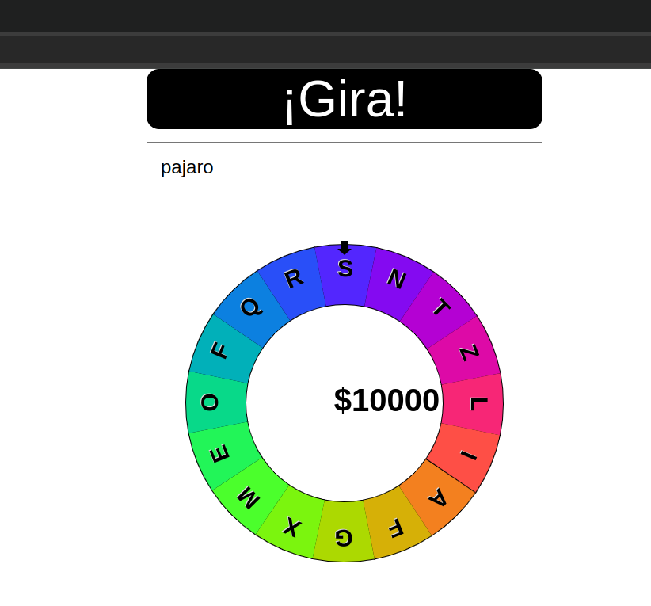

# Writeup

Una vez instalado el repositorio, se abre la página en el navegador de burpsuite, ya que usaremos un proxy.

Se gira la ruleta y el proxy intercepta la petición. Si se mandan las peticiones tal cual con la letra que sale, en la consola aparece el mensaje de _No Ganador_

Lo que tenemos que hacer es cambiar el valor del parámetro, en este caso se cambia la T por la X. Si se le da en forward para enviar la petición con el valor cambiado, podemos observar que sigue diciendo _No Ganador_ debido a que se debe obtener X en la ruleta 3 veces seguidas

Y se repite este proceso tres veces en caso de que las tres veces salgan letras diferentes de X. Finalmente obtenemos el premio en la ruleta y en la consola aparece el mensaje _Ganador_

